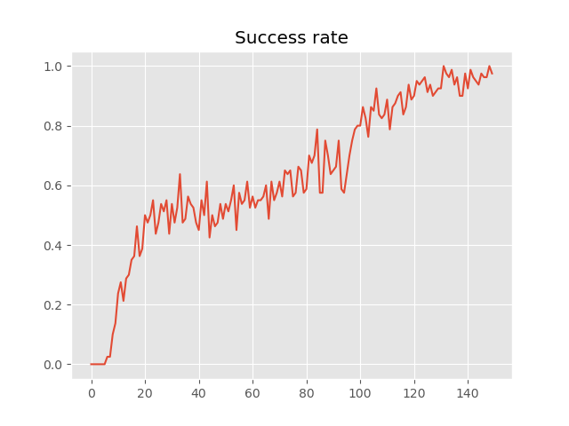

# DDPG+HER & TD3+HER to pick Strawberries

## 1. Introduction
This project aims to implement and compare the performance of Deep Deterministic Policy Gradient (DDPG) and Twin Delayed DDPG (TD3) with Hindsight Experience Replay Extension using an edited  MuJoCo's robotic FetchPickAndPlace environment to pick strawberries.

## 2. Dependencies  
- gym == 0.17.2  
- matplotlib == 3.1.2  
- mpi4py == 3.0.3  
- mujoco-py == 2.0.2.13  
- numpy == 1.19.1  
- opencv_contrib_python == 3.4.0.12  
- psutil == 5.4.2  
- torch == 1.4.0  

## 3. Installation Guide
```shell
pip3 install -r requirements.txt
```

## 4. Usage Guide

### 4.1 To Train the Strawberry Picker
1. Navigate to the file below and open it with a text editor of your choice.
```shell
nano ME5046/main.py
```
2. Change the following parameters as shown below.
```shell
Train         = True
Play_FLAG     = False 
```
3. Run the following command.
```shell
mpirun -np $(nproc) python3 -u main.py
```

### 4.2. To Watch the Trained Strawberry Picker
1. Navigate to the file below and open it with a text editor of your choice.
```shell
nano ME5046/main.py
```
2. Change the following parameters as shown below.
```shell
Train         = False
Play_FLAG     = True 
```
3. Run the following command.
```shell
python3 main.py
```

## 5. Demo of Trained Strawberry Picker
The GIF shows the trained strawberry picker putting the strawberries into the basket.
<p align="center">
  
</p>  


## 6. Result
### DDPG+HER
<p align="center">
  
</p>

### TD3+HER
<p align="center">
  
</p>

## 7. References
1. [_Continuous control with deep reinforcement learning_, Lillicrap et al., 2015](https://arxiv.org/abs/1509.02971)  
2. [_Hindsight Experience Replay_, Andrychowicz et al., 2017](https://arxiv.org/abs/1707.01495)
3. [_Addressing Function Approximation Error in Actor-Critic Methods_, Fujimoto et al., 2018](https://arxiv.org/pdf/1802.09477.pdf)
4. [_Multi-Goal Reinforcement Learning: Challenging Robotics Environments and Request for Research_, Plappert et al., 2018](https://arxiv.org/abs/1802.09464)  
## Acknowledgement
All the credit goes to [@alirezakazemipour](https://github.com/alirezakazemipour) for [his original implementation in PyTorch](https://github.com/alirezakazemipour/DDPG-HER) of [the original OpenAI's code](https://github.com/openai/baselines/tree/master/baselines/her).  

